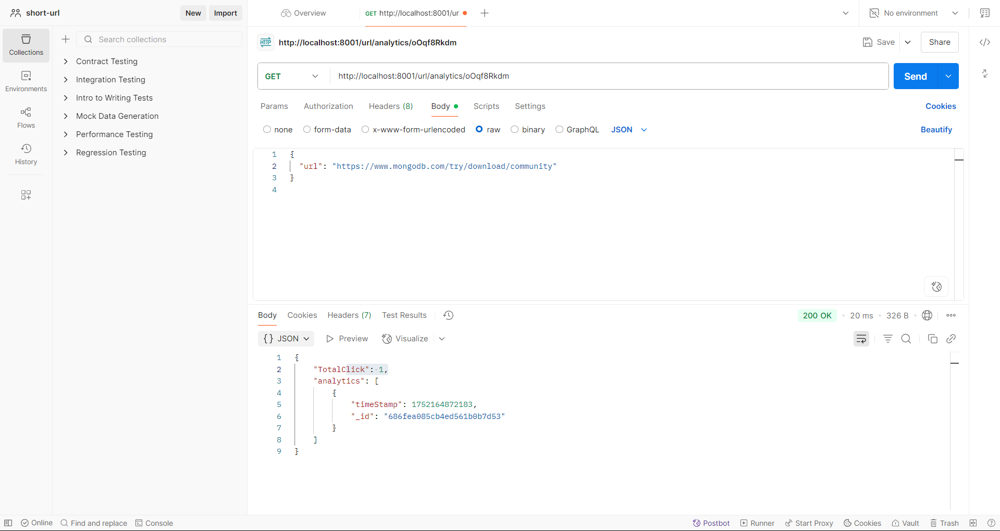
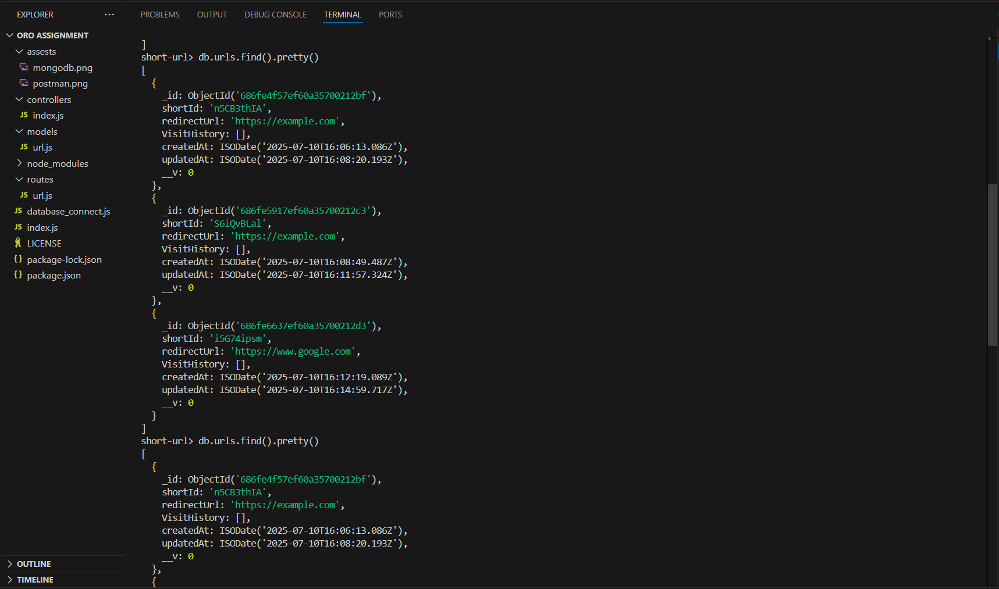
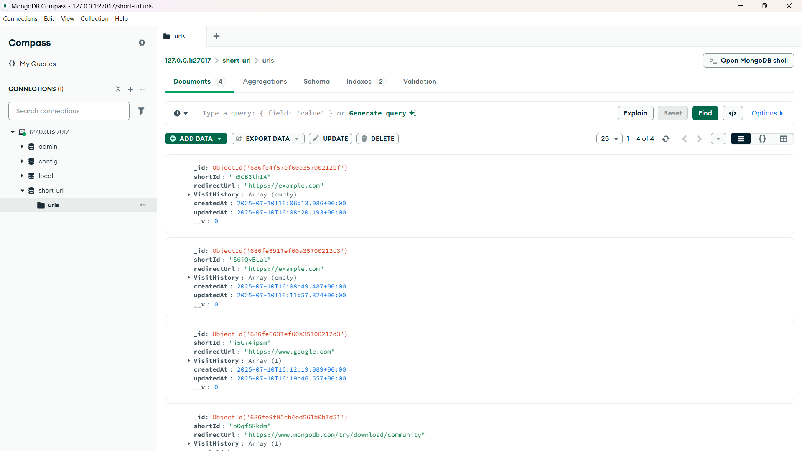
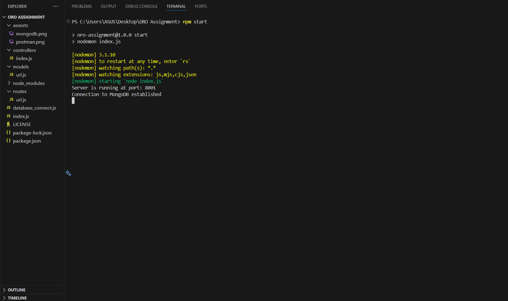

# **URL Shortener Backend Project**

A Simple URL Shortner API **Backend Project** which use technology like **Node Js , Express , MongoDB and Postman** for API testing.
It also supports **Click Tracking & Timestamps** analytics. 

Images are also added...

## Features
-  Shorten long URLs using a unique short code
-  Redirect to the original URL via short code
-  Track each click (timestamp and total count)

## Working
1. User submits a long URL (via POST request)
2. Server generates a short ID using `shortid`
3. Data is stored in MongoDB:
   - shortId
   - redirectUrl
   - VisitHistory (array of timestamps)
   - TotalClick (number)
   - createdAt and updatedAt
4. User accesses `/:shortId` to get redirected
5. Visit is logged and analytics are updated

##  Validation & Error Handling

- ✅ Checks if the URL is provided
- ❌ Invalid or missing URLs return 400 Bad Request
- ❌ Visiting unknown short links returns 404 or 410

# Steps to Run this program locally
  Make sure you have the following installed:
- [Node.js](https://nodejs.org/) (v14 or above)
- [MongoDB](https://www.mongodb.com/try/download/community) installed and running locally
- [Git](https://git-scm.com/) (for cloning the repo)

Now to clone this project in your system
```bash
git clone https://github.com/SuryaSahi/url-shortener-backend.git
cd url-shortener-backend
```

Lets install dependency
```bash
npm init
npm i express shortid valid-url
```

## Start MongoDB

Ensure your MongoDB service is running.  
To check via MongoDB shell:

```bash
mongosh
use short-url
```
**Now after installing all dependency we will run this project**

## Start the Server

```bash
npm start
```

Server will run on : **http://localhost:8001**


# Validation of our API using POSTMAN

## Test with Postman

- `POST /url` — Create a short URL  
- `GET /:shortId` — Redirect to original URL  
- `GET /url/analytics/:shortId` — View analytics

# To support the working of our project some images are also added in assets folder

## POSTMAN API TESTING


## MongoDB Shell (mongosh)


## MongoDB Compass 


## Terminal Running


Author : **Surya Pratap Sahi**
